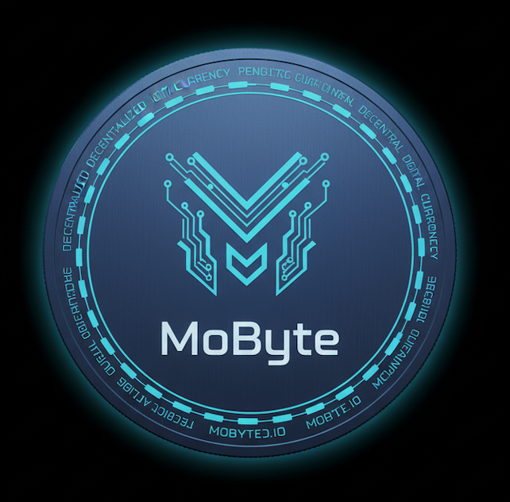

# **MoByte: A Decentralized Blockchain by Mahmoud**


[](https://www.python.org/downloads/)
[](https://flask.palletsprojects.com/)
[](https://pipenv.pypa.io/en/latest/)
[](https://opensource.org/licenses/Apache-2.0)

**MoByte** is a decentralized blockchain built in Python and Flask.
Created for educational and experimental purposes, it demonstrates the fundamentals of distributed ledger systems — including mining, proof-of-work, transactions, and network synchronization between nodes.

---

## **Table of Contents**

- [Features](#features)
- [Project Structure](#project-structure)
- [Getting Started](#getting-started)

  - [Prerequisites](#prerequisites)
  - [Installation & Setup](#installation--setup)

- [How to Use](#how-to-use)

  - [API Endpoints](#api-endpoints)

- [Running Multiple Nodes](#running-multiple-nodes)
- [Testing with Postman](#testing-with-postman)
- [Future Improvements](#future-improvements)
- [License](#license)

---

## **Features**

- **Complete Blockchain Implementation** – Includes mining, proof-of-work, hashing, and validation.
- **Transaction System** – Send and receive simulated cryptocurrency between users.
- **Network Consensus** – Synchronize and validate blocks across multiple nodes.
- **Dynamic Node Discovery** – Connect multiple Flask instances into a shared decentralized network.
- **REST API Interface** – Simple, human-readable JSON endpoints.
- **Lightweight & Docker-Ready** – Easy to deploy and experiment with locally or across multiple servers.

---

## **Project Structure**

```
/MoByte
|-- main.py                  # Flask app with API endpoints
|-- blockchain.py            # Core blockchain logic
|-- node.json                # List of connected nodes
|-- transaction.json         # Example transaction format
|-- Dockerfile               # Instructions to build the Docker image
|-- docker-compose.yml       # Defines the Docker service
|-- Pipfile                  # Lists project dependencies for pipenv
|-- Pipfile.lock             # Locks dependency versions for reproducibility
|-- LICENSE                  # Apache 2.0 License
└── README.md                # You're here!
```

---

## **Getting Started**

### **Prerequisites**

You’ll need:

- **Python 3.13+**
- **Flask**
- **pipenv** (for dependency management)
- _(Optional)_ **Docker** and **Docker Compose** for isolated deployment

---

### **Installation & Setup**

1. **Clone the Repository**

   ```bash
   git clone <your-repo-url>
   cd MoByte
   ```

2. **Install Dependencies (if running locally)**

   ```bash
   pip install flask requests
   ```

3. **Run the Main Node**

   ```bash
   python3 app.py --port 5001
   ```

   You’ll see output like:

   ```
   * Running on http://0.0.0.0:5001
   ```

---

## **How to Use**

You can interact with **MoByte** through its REST API using **Postman** or **curl**.

### **API Endpoints**

#### **1. Get the Full Blockchain**

- **URL:** `/get_chain`
- **Method:** `GET`
- **Example:**

  ```bash
  curl http://localhost:5001/get_chain
  ```

#### **2. Mine a New Block**

- **URL:** `/mine_block`
- **Method:** `GET`
- **Example:**

  ```bash
  curl http://localhost:5001/mine_block
  ```

#### **3. Add a New Transaction**

- **URL:** `/add_transaction`
- **Method:** `POST`
- **Body (JSON):**

  ```json
  {
    "sender": "Mahmoud",
    "receiver": "Ali",
    "amount": 20
  }
  ```

- **Example (curl):**

  ```bash
  curl -X POST http://localhost:5001/add_transaction \
  -H "Content-Type: application/json" \
  -d '{"sender":"Mahmoud","receiver":"Ali","amount":20}'
  ```

#### **4. Connect Nodes**

Used to link other blockchain nodes together.

- **URL:** `/connect_node`
- **Method:** `POST`
- **Body (JSON):**

  ```json
  {
    "nodes": [
      "http://127.0.0.1:5001",
      "http://127.0.0.1:5002",
      "http://127.0.0.1:5003"
    ]
  }
  ```

#### **5. Replace the Chain**

Synchronizes the blockchain with the longest valid one across all connected nodes.

- **URL:** `/replace_chain`
- **Method:** `GET`
- **Example:**

  ```bash
  curl http://localhost:5001/replace_chain
  ```

#### **6. Check Chain Validity**

- **URL:** `/is_valid`
- **Method:** `GET`
- **Example:**

  ```bash
  curl http://localhost:5001/is_valid
  ```

---

## **Running Multiple Nodes**

You can simulate a decentralized network by running several instances:

```bash
python3 app.py --port 5001
python3 app.py --port 5002
python3 app.py --port 5003
```

Then, connect them via:

```json
POST /connect_node
{
  "nodes": [
    "http://127.0.0.1:5001",
    "http://127.0.0.1:5002",
    "http://127.0.0.1:5003"
  ]
}
```

Now each node will share and synchronize blocks automatically when `/replace_chain` is called.

---

## **Testing with Postman**

1. **Open Postman**

   - Click **New → HTTP Request**
   - Select method `GET` or `POST` depending on the endpoint.

2. **Enter the URL**

   - Example:

     ```
     http://localhost:5001/mine_block
     ```

     or

     ```
     http://localhost:5001/add_transaction
     ```

3. **For POST requests**

   - Choose **Body → raw → JSON**
   - Paste JSON like:

     ```json
     {
       "sender": "Mahmoud",
       "receiver": "Node-2",
       "amount": 50
     }
     ```

4. **Send the Request**

   - Click **Send**
   - You’ll see a JSON response with the block details or confirmation.

5. **Mine the Next Block**

   - After adding transactions, call `/mine_block` again to record them into the chain.

6. **Check the Chain**

   - View your blockchain data via `/get_chain`.

---

## **Future Improvements**

- Implement digital signatures for secure transactions
- Add a simple web dashboard to visualize blocks
- Create persistent storage using SQLite or LevelDB
- Deploy nodes across multiple servers for real P2P networking
- Build a MoByte token wallet system

## Running Your Project with Docker

This project is configured to run seamlessly inside a Docker container.

### Prerequisites

- **Docker**: Ensure Docker Desktop (for Mac/Windows) or Docker Engine (for Linux) is installed and running.
- **Docker Compose**: Included with Docker Desktop. For Linux, you might need to install it separately.

### Building and Running

1.  **Build the Image & Run the Container**
    The `docker-compose up` command orchestrates the entire process. The `--build` flag ensures the image is built from the `Dockerfile`, and `-d` runs it in detached mode.

    ```bash
    docker compose up --build -d
    ```

2.  **Verify the Container is Running**
    You can check the status of your running containers with:

    ```bash
    docker ps
    ```

    You should see a container named `mo-byte` running and forwarding port `5001` to `5000`.

3.  **Access the container**

    ```bash
    docker compose exec app bash
    ```

4.  **Run the main script**

    ```bash
    python3 main.py
    ```

5.  **Next: Interact via API**
    Once it’s running, follow the steps in the [How to Use](#how-to-use) section to test your endpoints (e.g., `/mine_block`, `/add_transaction`, `/get_chain`, etc.).

> Make sure ports are mapped correctly (`5001:5001`) in your `docker-compose.yml` so Postman or curl can access the API.

### Interacting with the Container

- **Viewing Logs:**
  To see the output from the Flask application inside the container:

  ```bash
  docker compose logs -f
  ```

- **Accessing a Shell Inside the Container:**
  For debugging, you can get an interactive shell inside the running container:
  ```bash
  docker compose exec app bash
  ```
  This will place you inside the `/app` directory, where you can run commands.

### Stopping the Application

To stop and remove the containers defined by Docker Compose:

```bash
docker compose down
```

## Future Improvements

- **Add Transactions**: Modify the block structure to include a list of transactions, making the blockchain useful for more than just demonstrating proof-of-work.
- **Decentralized Network**: Implement a network of nodes where chains can be synchronized and consensus is reached across multiple participants.
- **Wallet and Signatures**: Add the ability to create cryptographic key pairs (wallets) and sign transactions.
- **Enhanced Testing**: Write comprehensive unit and integration tests for the blockchain logic and API endpoints.
- **Web Interface**: Create a simple front-end to visualize the blockchain and interact with the API.

## License

This project is licensed under the Apache License, Version 2.0. See the [LICENSE](LICENSE) file for details.
